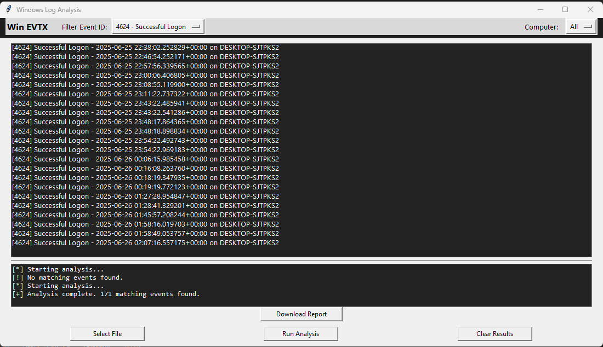
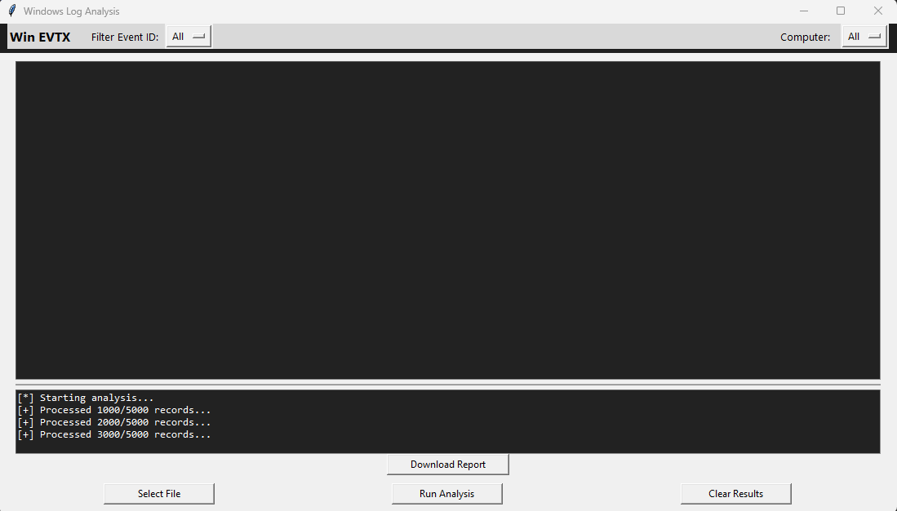
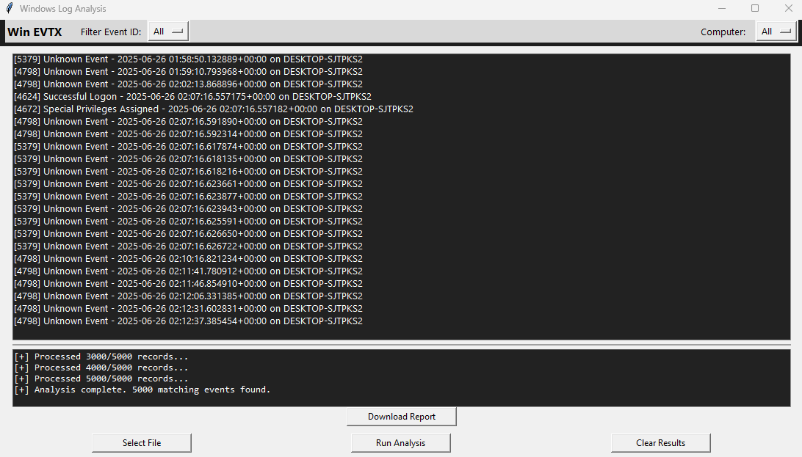

# Windows-Log-Analysis
A Python-based tool that parses Windows .evtx event log files to detect and flag suspicious behavior commonly investigated by SOC analysts. This project focuses on identifying key indicators such as brute-force login attempts, privilege escalation, unauthorized user creation, and PowerShell abuse.  License  MIT license

